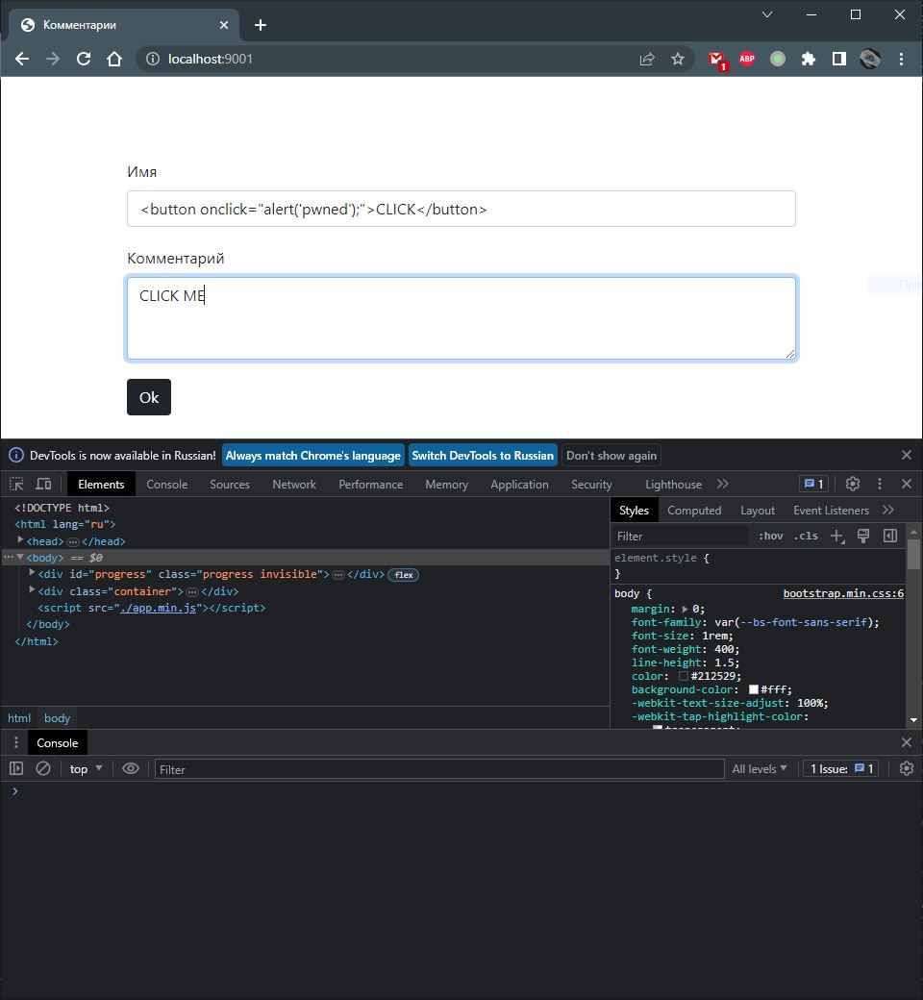
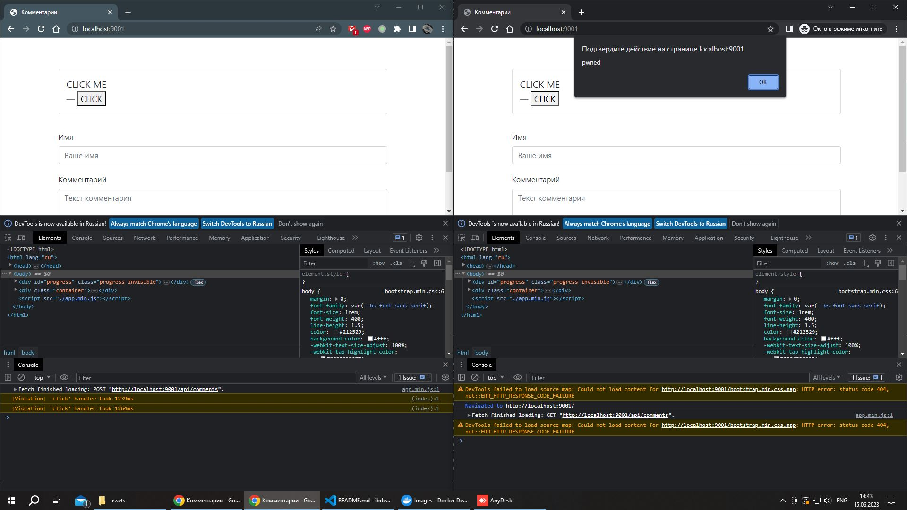

# Домашнее задание к занятию «1.4. JavaScript»

## Задание «Комментарии»

### Описание

Вам дали прототип системы комментариев для социальной сети.

### Этапы выполнения 

Для запуска используйте `docker-compose.yml`:

```yaml
version: '3.7'
services:
  comments:
    image: ghcr.io/netology-code/ibweb-js-comments
    ports:
      - 9001:9001
```

Для запуска используйте команду `docker-compose up`.

Для остановки и удаления контейнеров используйте `docker-compose down`.

Фронтенд сервиса работает на порту 9001:


1. Откройте целевой сервис в двух экземплярах браузера — обычном и приватном — или в разных браузерах.
2. Отправьте ваш вредоносный ввод с помощью форм ввода так, чтобы он содержал код `alert('pwned')`, либо его вариации в первом экземпляре браузера.
3. Обновите страницу во втором экземпляре браузера: если код выполнится при загрузке или после выполнения целевых действий пользователя, например, клике (`onclick`), наведении указателя мыши (`onhover`) или других событиях ([см. полный список](https://developer.mozilla.org/en-US/docs/Web/Events)), то вы добились своего.

Примечание*. Часто будет достаточно `onclick`.

Используя ваши знания, попробуйте подобрать данные для формы так, чтобы исполнился целевой код (`alert('pwned')`).

### Результаты выполнения задания

В качестве результата пришлите используемые данные для ввода.

### Ответ

В поле имя достаточно ввести:
```text
<button onclick="alert('pwned');">CLICK</button>
```

В поле комментарии можно что-угодно, текст, введеный в это поле, распознается как текст и не встраивается в html-код страницы.
После "сабмита" комментария, появляется кнопка, по нажатии на которую исполняется код.
